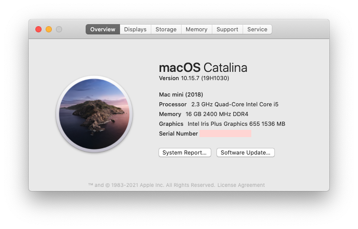
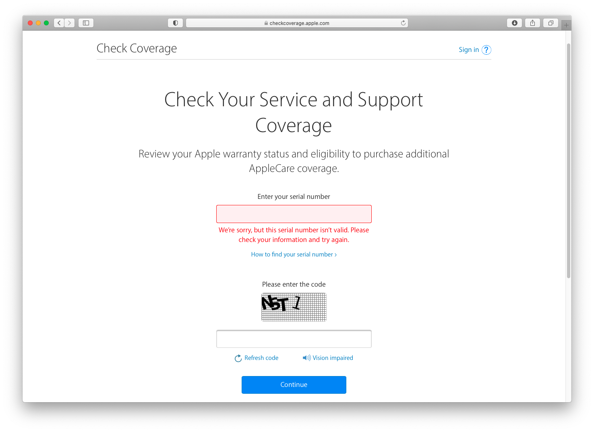

# NUC8I5BEH 黑苹果 (OpenCore)

[English](./README.md) | 简体中文

### 支持的macOS版本
+ macOS Mojave
+ macOS Catalina
+ macOS Big Sur
+ macOS Monterey 12.4（我正在使用的版本）

### 配置
+ 操作系统: macOS Monterey 12.4 21F79 x86_64 / Macmini8,1
+ OpenCore: 0.8.1
+ CPU: Intel® Core™ i5-8259U Processor (6M Cache, up to 3.80 GHz)
+ 硬盘: 1TB [Lexar NM620](https://union-click.jd.com/jdc?e=618%7Cpc%7C&p=JF8BAOcJK1olXwcEVlZcD0oXB18IGloUXQEGVVdUDEwnRzBQRQQlBENHFRxWFlVPRjtUBABAQlRcCEBdCUoWA2gMGlIcWQEdDRsBVXtjX2ZJUz9tX2N0MgMJaRl0ahl-ZCdlUQoyVW5dCUoWAWsJH18VbTYCU24LZksWAm4IGFsXXgQyVW5dD08TC2gBGFwXXQEGZFldAXvOnenctsJgOdKQ1Yr8t52zq7aRqmslbQUyU15UHE1lQj0cHSklbQYyV24fZhsXATtfGQwWVAICUFsKD0ofAGgMGVgRXlNRXF1UD0gVM20JGl8cbTY)
+ 内存: 16GB x 2 [ADATA DDR4 2666](https://union-click.jd.com/jdc?e=618%7Cpc%7C&p=JF8BAN4JK1olXDYCVV9cCUoQAGgNHV4lGVlaCgFtUQ5SQi0DBUVNGFJeSwUIFxlJX3EIGloUXAcFV1lYDk4IWipURmtDBW1LISU2bylVU3FRSDlRWXZfSjktBEcnAl8IGloUXwIDUFpdOHsXBF9edVsUXAcDVV9bCE4nAl8IHF8RVQEEXF9fCk0TM2gIEmvMw4DW-ccobJ-FgruppI2x9d-b5W5tOEgnBG8BD11nHFQWUixtOEsnAF9KdVpCWFYEXF5UAR9CUWpdGgtGWgcGAwoOXBwfCz1dE1odbQQDVVpUOHs)
+ BIOS: [0078](https://drivers.softpedia.com/get/BIOS/Intel/Intel-NUC8i5BEH-NUC-Kit-BIOS-0078.shtml)
+ 显示器: [KOIOS K2721UD 4K 27](https://union-click.jd.com/jdc?e=&p=JF8BANUJK1olXQEGU19aCksXAF8LEl0XVAIBUl9eDntTXDdWRGtMGENDFlVDFhNSVzMXQA4KD1heSl1UDkkeB2wOGlgTQl9HCANtYx58XipQUhJwL3BCVlgKWzUJVg92e1cZbQcyVF9cCUkTAmsMG2slXQEyFTBaCkIXA2o4GmsVWgQBUVpeDkMTAWsNK1wVVDbbytiJpdJiZ7uamo-04tCm_IfEuXsnM2w4K2sVbQUyFjBYAB4fAGZbSwxCXVIHAwoKAEsUVDwKSw8dXgMEAw0PDnsVAm4MEms)

### BIOS设置
+ __禁用__
	- Legacy Boot
	- Fast Boot
	- Network Boot
	- Secure Boot
	- Inter VT for directed I/VO(VT-d)
+ __启用__
	- Boot USB Devices First
	- Boot Network Devices Last
+ __Wake on LAN from S4/S5__
	- Stay Off

### 使用方法
1. 将 **EFI** 和 **NUC8_MacOnlineInstaller** 放入FAT32 U盘根目录
2. 根据操作系统，执行**NUC8_MacOnlineInstaller**中对应的run脚本
3. 以上步骤完成后关机，使用U盘安装系统

### 激活iMessage/FaceTime
1. 使用[Hackintool](https://github.com/headkaze/Hackintool)生成**Serial Number**, **Board Serial Number** 和 **SmUUID**
2. 在[https://checkcoverage.apple.com](https://checkcoverage.apple.com)查询你的**Serial Number**，并确保查询结果如下图所示，否则继续摇号

3. 在 *config.plist* 中替换它们
4. 重启电脑

---

## Show your support

Give a ⭐️ if this project helped you!
